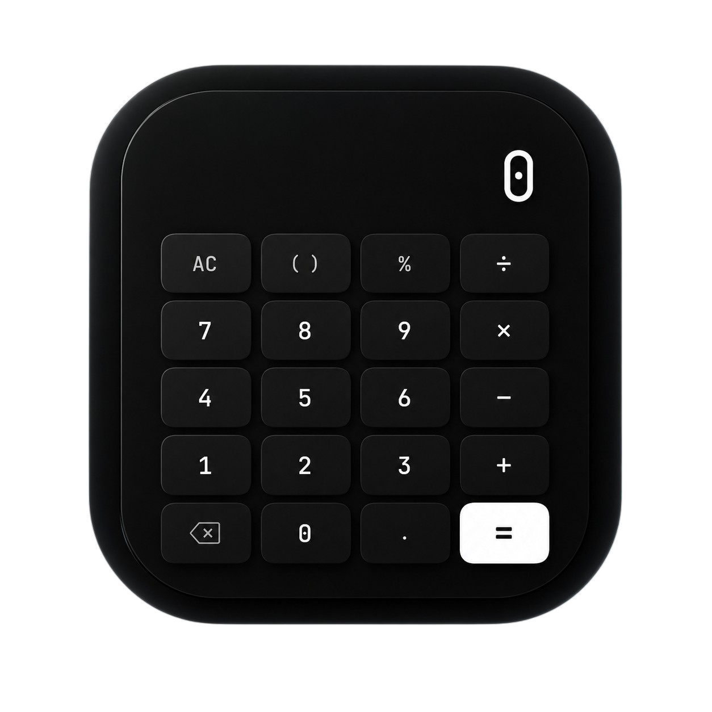
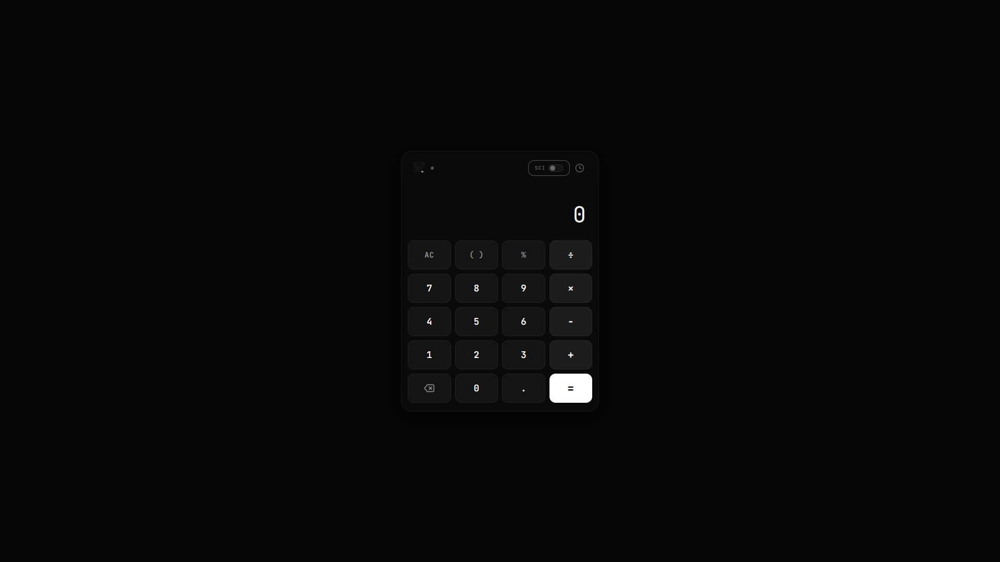
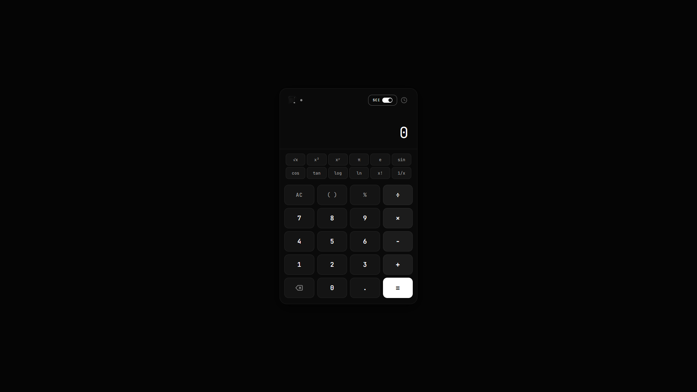

<div align="center">



# SISTEMA DE CALCULADORA B&W

**Calculadora web premium com estética dark minimalista**

[](#tecnologias)
[](#tecnologias)
[](#tecnologias)

</div>

---

# Preview

<div align="center">

# Modo Padrão



</div>

---

# Modo Científico

<div align="center">



</div>

---

# Histórico de Cálculos

<div align="center">


</div>

---

# Sobre o Projeto

Calculadora web desenvolvida com HTML5, CSS3 e JavaScript puro. Interface dark minimalista premium com foco em usabilidade, performance e acabamento visual profissional.

# Funcionalidades

# Calculadora Básica

- Operações fundamentais: adição, subtração, multiplicação e divisão
- Porcentagem e decimal
- Parententação para expressões complexas
- Botão de limpar (AC) e apagar último caractere (backspace)

# Calculadora Científica

- Raiz quadrada (√x)
- Potência (x² e xʸ)
- Constantes matemáticas (π e e)
- Funções trigonométricas (sen, cos, tan)
- Logaritmos (log, ln)
- Fatorial (x!) e inversão (1/x)

# Histórico de Cálculos

- Registro automático de todas as operações
- Persistência via localStorage
- Reutilização de cálculos anteriores com um clique
- Limpeza individual ou total do histórico

# Suporte ao Teclado

| Tecla | Ação |
|-------|------|
| `0` a `9` | Números |
| `+ - * /` | Operadores |
| `Enter` | Calcular |
| `Escape` | Limpar |
| `Backspace` | Apagar último caractere |
| `( )` | Parênteses |
| `%` | Porcentagem |

# Tecnologias

- **HTML5** — Estrutura semântica
- **CSS3** — Design responsivo com variáveis CSS
- **JavaScript Vanilla** — Lógica pura, sem dependências externas

# Estrutura de Pastas

```
SISTEMA DE CALCULADORA B&W/
├── INDEX.HTML                Página principal
├── CSS/
│   └── STYLE.CSS             Estilos e design system
├── JS/
│   └── SCRIPT.JS             Lógica da calculadora
├── ASSETS/
│   ├── SISTEMADECALCULADORABW.PNG
│   └── SCREENSHOTS/
└── README.MD
```

# Fluxo de Funcionamento

1. **Entrada** — Usuário digita números via teclado virtual ou físico
2. **Operação** — Seleciona o operador matemático desejado
3. **Cálculo** — Expressão é processada por um parser seguro (sem `eval()`)
4. **Resultado** — Exibido com formatação brasileira e animação sutil
5. **Histórico** — Cálculo é registrado automaticamente no localStorage

# Armazenamento Local

O histórico utiliza `localStorage` do navegador para persistir dados entre sessões. Nenhum dado é enviado a servidores externos.

# Responsividade

- **Desktop** — Layout centralizado com largura máxima de 380px
- **Tablet** — Adaptação automática para telas intermediárias
- **Smartphone** — Layout fullscreen com botões ampliados para melhor usabilidade

# Identidade Visual

- Paleta: preto (#050505), branco (#ffffff) e cinzas
- Tipografia: JetBrains Mono para números, Inter para interface
- Bordas sutis com raio de 12px
- Sombras discretas e transições suaves
- Animações funcionais sem excesso visual

# Como Executar

```bash
# Clone o repositório
git clone https://github.com/SEU-USER/sistema-de-calculadora-bw.git

# Acesse a pasta
cd sistema-de-calculadora-bw

# Abra o index.html no navegador
start index.html
```

# Publicar no GitHub Pages

```bash
# Crie um repositório no GitHub
# Faça push do código
git add .
git commit -m "Publicação inicial"
git push origin main

# Ative GitHub Pages:
# Settings > Pages > Source: main branch
```

# Compatibilidade

- Chrome 90+
- Firefox 88+
- Safari 14+
- Edge 90+
- Navegadores mobile modernos

# Objetivo

Projeto desenvolvido como exercício de design e desenvolvimento web front-end, demonstrando capacidade de criar interfaces profissionais com JavaScript puro.

# Possíveis Evoluções

- Mais funções científicas
- Conversor de unidades
- Suporte a expressões complexas
- Tema claro (toggle light/dark)
- Atalhos de teclado customizáveis
- Exportação do histórico

# Status

Projeto **concluído** e funcional.


---

<div align="center">

Feito com HTML5, CSS3 e JavaScript

</div>
